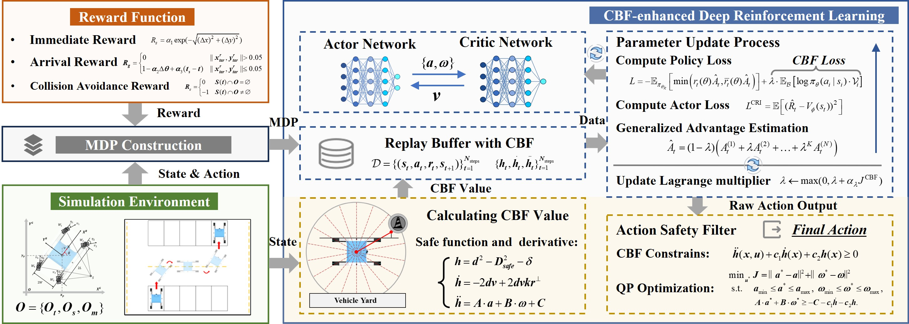
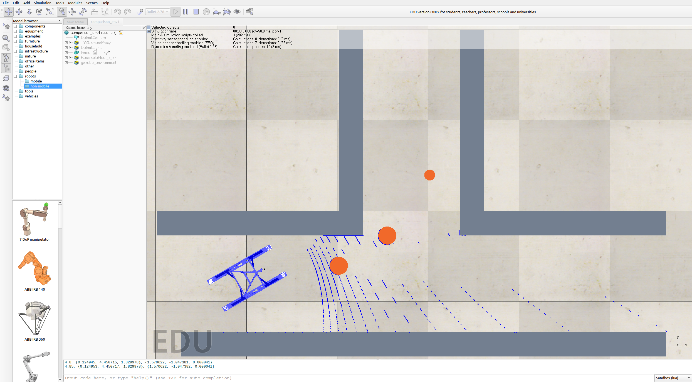
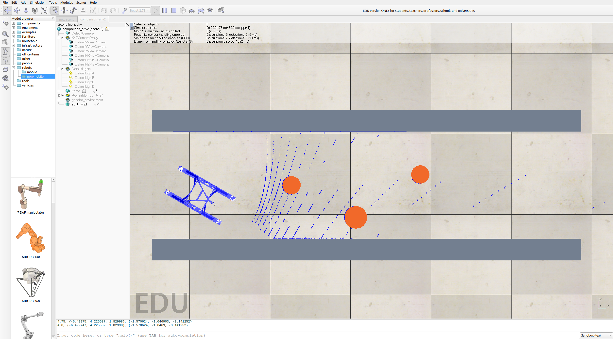
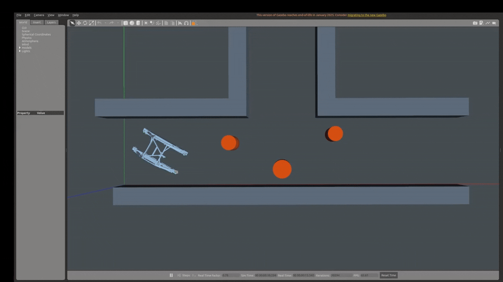
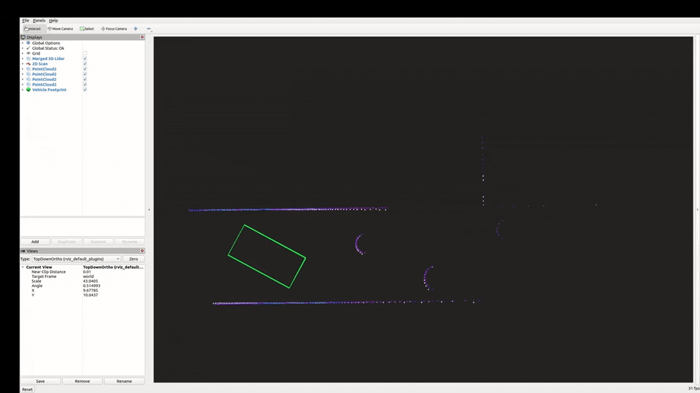
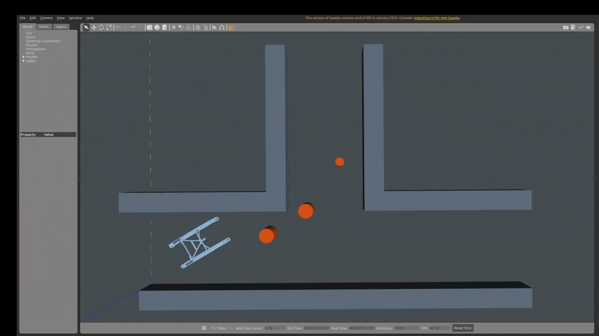

# CBF-PPO: A DRL-based Trajectory Planner for AGV in Ro/Ro Terminal

This repository contains the CBF-enhanced PPO algorithm, the CoppeliaSim
simulation interface, and the open Gazebo/RViz environments for 4WIS AGV
trajectory planning in Ro/Ro terminal scenarios.

## Core Functions

- Distance-based second-order Control Barrier Function (CBF) constraints.
- CBF-enhanced Proximal Policy Optimization (CBF-PPO).
- CoppeliaSim control demo and remote API interface for the transport AGV.
- Open Gazebo/RViz simulation environments used for reviewer-response
  reproducibility and visualization.

  

## Folder Structure

| Folder | Description |
| --- | --- |
| `algorithm/` | Core CBF-PPO implementation. `cbf-ppo.py` defines the policy, value network, PPO update, and CBF penalty logic. `compute_cbf.py` provides the CBF calculation and safety-filter components. |
| `Simulation Env/` | CoppeliaSim/V-REP remote API files and a simple control demo. `sim.py`, `simConst.py`, `remoteApi.dll`, and `remoteApi.so` support remote connection; `control_demo.py` demonstrates four-wheel steering control; `sim.7z` stores the packaged simulation resource. |
| `Gazebo Env/` | Standalone ROS 2 Humble/Gazebo Classic package for the open AGV environment. It includes launch files, Gazebo worlds, AGV model assets, RViz configuration, controller configuration, and sensor-processing plugins. See `Gazebo Env/README.md` for build and launch commands. |
| `document/` | Figures and animations used in this README, including CoppeliaSim comparison environments and Gazebo/RViz demonstrations for Env1 and Env2. |

## Demonstration Figures

The following figures correspond to the environments and visualization materials
added for the reviewer response.

### CoppeliaSim Comparison Environments

| Env1 | Env2 |
| --- | --- |
|  |  |

### Gazebo and RViz Demonstrations

| Env1 Gazebo | Env1 RViz |
| --- | --- |
|  |  |

| Env2 Gazebo | Env2 RViz |
| --- | --- |
|  |  |
